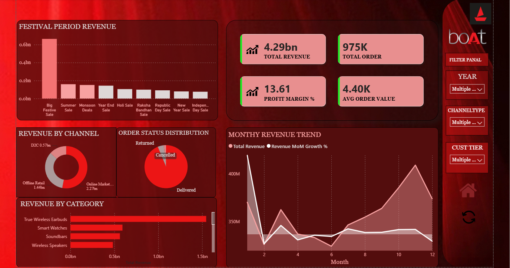

# 🚤 Boat Sales Analytics — Performance & Customer Intelligence Dashboard
 


 
> An end-to-end data analytics portfolio project covering **Python data cleaning**, **SQL business querying**, and a **4-page interactive Power BI dashboard** — built on a 5-table boAt sales dataset (sales, channel, product, customer, delivery).
 
---
 
## 📑 Table of Contents
 
- [Overview](#-overview)
- [Top Insights](#-top-insights)
- [Dashboard Preview](#-dashboard-preview)
- [Tech Stack](#-tech-stack)
- [Project Structure](#-project-structure)
- [Datasets](#-datasets)
- [Workflow](#-workflow)
- [DAX Measures](#-dax-measures-power-bi)
- [Dashboard Pages](#-dashboard-pages)
- [Key Findings & Business Recommendations](#-key-findings--business-recommendations)
- [How to Explore This Project](#-how-to-explore-this-project)
- [Full Report](#-full-report)
- [Author](#-author)
---
 
## 📊 Overview
 
The **Boat Sales Analytics** project demonstrates the full modern data analyst stack — from raw CSVs to an executive-ready Power BI dashboard. Working across five interconnected datasets (sales, channel, product, customer, delivery), the project uncovers revenue trends, customer behaviour patterns, channel profitability, and delivery performance.
 
| 📁 5 Datasets | 🛠️ 3 Tools | 🧩 15+ DAX Measures | ✅ Status |
|---|---|---|---|
| Sales · Channel · Product · Customer · Delivery | Python · SQL · Power BI | Revenue, Growth, Rates, RFM | Completed (2025) |
 
---
 
## 🏆 Top Insights
 
| # | Insight |
|---|---|
| 1 | **Online channel drives 57% of revenue** but delivers a lower profit margin than offline channels |
| 2 | **Gold-tier customers** (41% of the customer base) contribute **41% of total profit** |
| 3 | **Festival periods generate 2.3x** the average order value vs. non-festival periods |
| 4 | Top delivery partner averages **2.10 delivery days** with a **4.1/5** customer rating |
| 5 | **Wired earphones** post the highest profit margin (**20.86%**) across all product categories |
 
---
 
## 🖼️ Dashboard Preview
 
> GitHub can't render a `.pbix` file interactively in the browser — it's a binary file format. To make the dashboard explorable from the README itself, drop PNG/GIF exports of each page into `outputs/` and embed them here, e.g.:
>
> ```markdown
> 
> 
> 
> 
> ```
>
> For a truly *live, clickable* version (not just images), see [How to Explore This Project](#-how-to-explore-this-project) below — publishing to the Power BI Service gives you a shareable interactive link you can drop right under this section.
 
---
 
## 🛠️ Tech Stack
 
| Tool | Purpose |
|---|---|
| **Python (Pandas)** | Data loading, cleaning, merging, EDA, statistical analysis |
| **Matplotlib / Seaborn** | Visualising trends, distributions, comparisons |
| **SQLAlchemy + SQLite/MySQL** | Relational database setup, 10+ business SQL queries |
| **Power BI Desktop** | 4-page interactive dashboard, 15+ DAX measures |
| **Jupyter Notebooks** | Iterative analysis & documentation |
 
---
 
## 📂 Project Structure
 
```
BoatSalesProject/
├── data/
│   ├── raw/                 ← Original CSVs (never modified)
│   └── cleaned/              ← Cleaned & transformed versions (master_sales.csv)
├── notebooks/                 ← Jupyter Notebooks (EDA, cleaning, SQL)
├── sql/                       ← SQL scripts (.sql files)
├── powerbi/
│   └── BoatSalesData.pbix     ← Power BI report (open in Power BI Desktop)
├── outputs/                   ← Chart & dashboard PNG/GIF exports
├── docs/
│   └── Boat_Sales_Analytics_Report.docx   ← Full written report
└── README.md                  ← You are here
```
 
---
 
## 🗄️ Datasets
 
| Dataset | Description |
|---|---|
| `salesdata` | Core fact table — order ID, dates, amounts, discounts, status, delivery days |
| `saleschannel` | Channel dimension — online, offline, marketplace types |
| `productdetails` | Product dimension — category, MRP, cost, margin |
| `customerdetails` | Customer dimension — tier, segment, city, state, signup date |
| `deliverypartnerdata` | Delivery dimension — partner name, avg days, rating, region |
 
---
 
## 🔄 Workflow
 
**1. Setup & Planning** — project folder structure, environment, library installs (`pandas`, `numpy`, `matplotlib`, `seaborn`, `sqlalchemy`, `openpyxl`, `jupyter`, `plotly`).
 
**2. Python — Data Cleaning & EDA**
- Parsed dates, derived `Year` / `Month` / `Quarter` columns
- Handled nulls, coerced types, removed duplicate `SalesID`s
- Validated business logic (e.g. no negative `NetSales`)
- Explored revenue trends, channel performance, customer tiers, festival impact, cancellations/returns, and delivery partner performance
- Merged all five tables into a single `master_sales.csv`
**3. SQL — Database & Business Queries**
- Loaded cleaned tables into a relational database via SQLAlchemy
- Wrote 10 business queries: revenue/profit trends, channel performance, top products, customer tier breakdown, festival comparison, cancellation/return rates, delivery ranking, YoY growth (`LAG()`), and RFM segmentation (CTEs + window functions)
**4. Power BI — Interactive Dashboard**
- Built a star schema (sales fact table + 4 dimension tables, many-to-one relationships)
- Created 15+ DAX measures for KPIs, rates, and time intelligence
- Designed a 4-page interactive report (see below)
---
 
## 🧮 DAX Measures (Power BI)
 
| Measure | Logic |
|---|---|
| Total Revenue | `SUM(salesdata[NetSales])` |
| Total Profit | `SUM(salesdata[Profit])` |
| Total Orders | `COUNT(salesdata[SalesID])` |
| Avg Order Value | `DIVIDE([Total Revenue], [Total Orders], 0)` |
| Profit Margin % | `DIVIDE([Total Profit], [Total Revenue], 0) * 100` |
| Cancellation Rate % | `DIVIDE(CALCULATE([Total Orders], status="Cancelled"), [Total Orders]) * 100` |
| Return Rate % | `DIVIDE(CALCULATE([Total Orders], status="Returned"), [Total Orders]) * 100` |
| Revenue MoM Growth % | `DATEADD(-1, MONTH)` comparison |
| Revenue YoY Growth % | `SAMEPERIODLASTYEAR()` comparison |
| Avg Delivery Days | `AVERAGE(salesdata[DeliveryDays])` |
 
*(15+ measures total — see the `_Measures` table inside the `.pbix` for the full list.)*
 
---
 
## 📑 Dashboard Pages
 
**Page 1 — Executive Summary**
5 KPI cards · Monthly revenue trend (area chart + MoM overlay) · Revenue by channel (donut) · Revenue by category (bar) · Year/Quarter/Channel/Tier slicers
 
**Page 2 — Channel & Product Analysis**
Channel × Category matrix · Waterfall (MRP → Discount → Net Sales → Profit) · Discount vs. Profit scatter · Top 15 products by profit
 
**Page 3 — Customer Intelligence**
Orders by tier & segment (stacked bar) · Revenue by state/city (map) · New vs. returning customers (line) · Top 20 customers table · Payment method by tier
 
**Page 4 — Operations & Delivery**
Avg delivery days by partner (bar) · Cancellation rate (gauge) · Cancellation reasons (treemap) · Delivery partner scatter (days vs. rating) · Festival-wise revenue table
 
---
 
## 💡 Key Findings & Business Recommendations
 
<details>
<summary><strong>Revenue & Channel</strong></summary>
| Finding | Recommendation |
|---|---|
| Online = 57% of revenue | Prioritise digital channel investment & UX |
| Online margin < offline | Review online discount strategy |
| Top 3 products > 34% of revenue | Protect hero-product inventory; build cross-sell |
| Wired earphones = 20.86% margin | Increase accessory attach rate at checkout |
 
</details>
<details>
<summary><strong>Customer</strong></summary>
| Finding | Recommendation |
|---|---|
| Gold tier (41% of customers) = 41% of profit | Launch Gold-tier loyalty programme |
| Festival AOV = 2.3x normal | Stock inventory 3–4 weeks pre-festival |
| Top 20 customers = high AOV | Assign dedicated account managers |
 
</details>
<details>
<summary><strong>Operations</strong></summary>
| Finding | Recommendation |
|---|---|
| Best partner: 2.10 days, 4.1/5 rating | Shift more delivery volume to this partner |
| Slowest partner = higher cancellations | Issue performance improvement notice |
| Cancellations driven by 2 main reasons | Address root causes (address issues, COD confirmation) |
 
</details>
---
 
## 🚀 How to Explore This Project
 
### Option A — Open the dashboard locally (full interactivity)
1. Install the free **[Power BI Desktop](https://powerbi.microsoft.com/desktop/)** (Windows only)
2. Clone this repo:
```bash
   git clone https://github.com/<your-username>/<your-repo>.git
```
3. Open `powerbi/BoatSalesData.pbix` in Power BI Desktop — all visuals, slicers, and DAX measures are fully interactive.
### Option B — View it live, no install required
1. Publish the report from Power BI Desktop: **File → Publish → Publish to web** (or your org's Power BI Service workspace)
2. Copy the embed/share link
3. Paste it into this README under [Dashboard Preview](#-dashboard-preview) — viewers can click through filters and slicers directly from the link, no app needed
4. *(Optional)* Note: GitHub strips `<iframe>` tags from rendered Markdown for security, so the live link works as a clickable **badge/button**, not an inline embed — e.g.:
```markdown
   [](https://your-published-report-link)
```
 
### Option C — Re-run the analysis
1. `pip install pandas numpy matplotlib seaborn sqlalchemy openpyxl jupyter plotly`
2. Run notebooks in `notebooks/` in order (cleaning → EDA → SQL export)
3. Run queries in `sql/` against the generated database
---
 
## 📄 Full Report
 
The complete written report — methodology, full EDA, SQL queries, and all findings — is available at [`docs/Boat_Sales_Analytics_Report.docx`](docs/Boat_Sales_Analytics_Report.docx).
 
---
 
## 👤 Author
 
**Data Analyst** — Portfolio Project, 2025
Built with Python · SQL · Power BI
 
⭐ If this project was useful or interesting, consider starring the repo!

